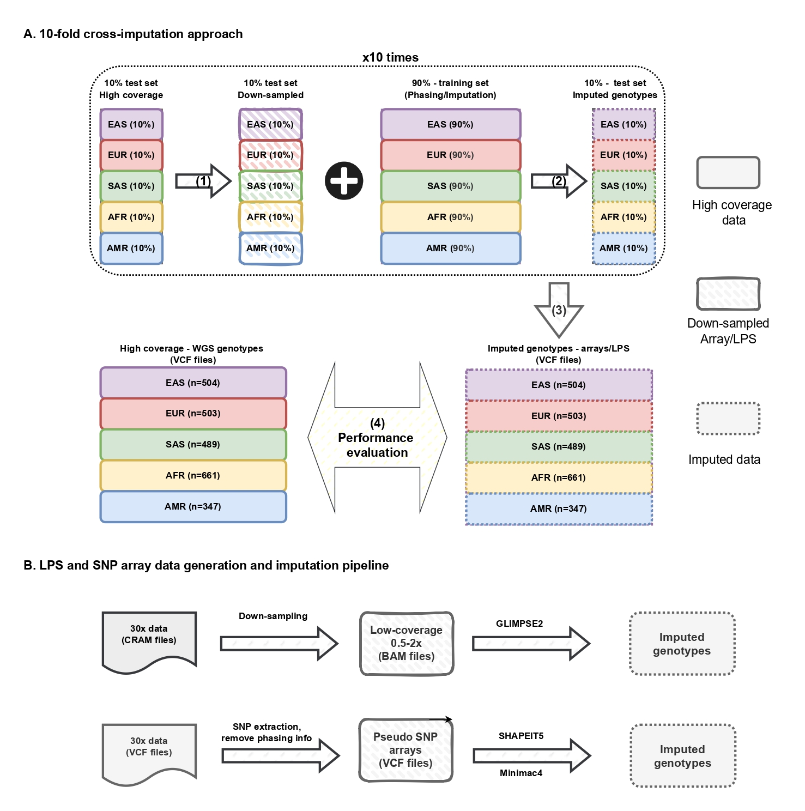

# Polygenic score and imputation accuracy from low-pass sequencing in diverse population

This documentation provides comprehensive information on the code, data, and methods used in the article.

## Study Summary: Comparing Genotyping Arrays and Low-Pass WGS

Traditional GWAS and PGS studies use SNP arrays with genotype imputation, but **low-pass whole-genome sequencing (lpWGS)** is emerging as a strong alternative.

### Study Design
- **Compared**: 8 genotyping arrays vs. 6 lpWGS coverage levels (0.5× to 2×)
- **Population**: 2,504 individuals from the 1000 Genomes Project
- **Methods**: Applied 10-fold cross-validation to perform genotype imputation and evaluate polygenic scores (PGS) across 4 traits. Results were summarized and assessed for performance.

### Key Findings
- lpWGS matched population-optimized arrays in imputation and PGS accuracy
- lpWGS outperformed arrays in underrepresented populations
- lpWGS was superior for rare and low-frequency variants

### Conclusion
Low-pass WGS is a **flexible and powerful alternative** to genotyping arrays, especially valuable for studies involving **diverse or underrepresented populations**.

## Analytical Pipeline Summary

<figcaption style="
    max-width: 100%; 
    margin: 0 auto; 
    font-size: 0.80em;
    text-align: justify;
  ">
    Figure 1: Overview of the analytical pipeline. A) 10-fold cross-imputation approach; (1) 10% of the samples are downsampled (BAM files) or filtered to retain only array variants (VCF files) to generate pseudo LPS and pseudo array data; (2) these data are imputed using the remaining 90% of the samples as the reference panel; (3) the imputed data from all batches are combined and then split by population; (4) performance is evaluated using high-coverage genotyping data as the ground truth. B) Data generation and imputation pipeline for LPS and SNP array data. 
</figcaption>
 

This study analyzes data from 2,504 unrelated individuals in the 1000 Genomes Project[@byrska2022high], re-sequenced at high coverage (30x) by the New York Genome Center (1KGPHC). Two main data sources are utilized:

- Mapped sequence data (CRAM format)
- Phased variant data (VCF format)

## Processes

1. Processing data:
      - [Cross-Validation Framework](processing_data/cross_validation.md): A 10-fold stratified cross-validation ensures balanced population representation for imputation testing.
      - [Variant Filtering](processing_data/variant_filtering.md): VCF files are filtered to improve imputation accuracy.
      - [Data Simulation](processing_data/data_simulation.md): Low-pass sequencing and eight SNP arrays data are simulated from high-coverage data.
2. Genotype Imputation: 
      - [lpWGS](imputation/lps_imputation.md): GLIMPSE2 is used for lpWGS imputation.
      - [SNP arrays](imputation/array_imputation.md): undergo phasing with SHAPEIT5 and imputation with Minimac4.
3. Evaluation:
      - [Restructure imputed data](evaluation/restructure_imputed_data.md): Imputed data is merged by population
      - [lpWGS performance](evaluation/lps_performance.md): compared to 30x WGS to assess accuracy and coverage performance, followed by visualization.
      - [PRS performance](evaluation/prs_performace.md): We calculated PRS and compared it to 30× WGS to assess PRS performance and visualize the results.
  
## Appendix
- [Available data](available_data.md): Information on the datasets used in this study.
- [About](about.md): Acknowledging contributions and support.