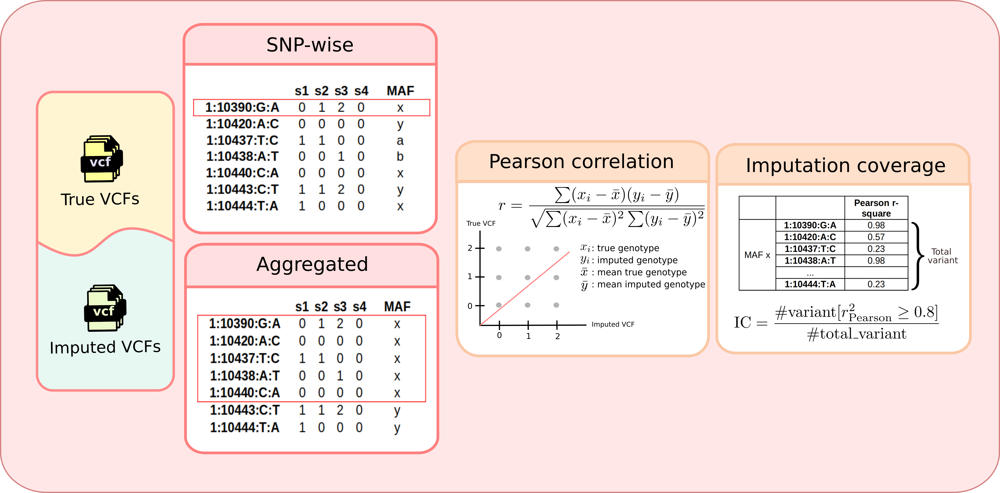

## Evaluation methods


To assess imputation performance, two key metrics are used: {==Imputation Accuracy==} and {==Imputation Coverage==}. These metrics quantify the quality and completeness of imputed genetic variants, and are calculated per chromosome across all autosomes.

| Metric                  | Description                                     | Purpose                                                |
|-------------------------|-------------------------------------------------|--------------------------------------------------------|
| **Imputation Accuracy** | Mean $r^2$ of sites within a bin                 | Measures how well imputed values match true genotypes  |
| **Imputation Coverage** | Proportion of variants with $r^2 \geq 0.8$ in a bin | Assesses the proportion of high-confidence imputations |

## Evaluation process

Evaluatate imputation by SNPs: 

- [compute_MAF.sh](https://github.com/KTest-VN/lps_paper/blob/main/evaluation/lps_evaluation/bin/compute_MAF.sh)
- [run_evaluate.py](https://github.com/KTest-VN/lps_paper/blob/main/evaluation/lps_evaluation/bin/run_evaluate.py)  

```bash  
  --8<-- "evaluation/lps_evaluation/EVALUATE_imputation.sh"
```

Evaluate imputation accuracy by bin: 

- [get_coverage.py](https://github.com/KTest-VN/lps_paper/blob/main/evaluation/lps_evaluation/bin/get_coverage.py)  

```bash
  --8<-- "evaluation/lps_evaluation/COMPUTE_accuracy_perbin.sh"
```