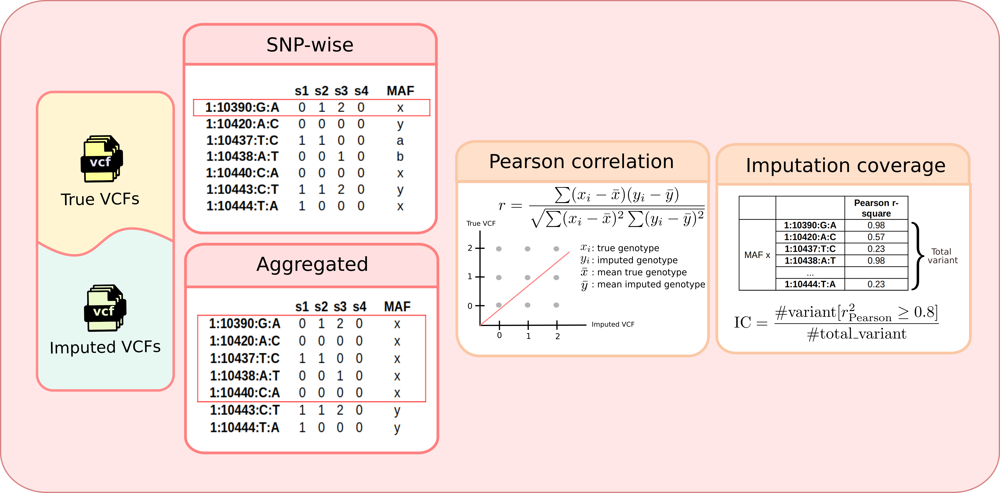

## Evaluation methods


To evaluate imputation performance, we employed two primary metrics: Imputation Accuracy and Imputation Coverage. 

{==Imputation accuracy==} was quantified using the ^^SNP-wise Pearson correlation^^ ($r^2$) between imputed and true genotypes, whereas {==Imputation coverage==} was defined as the proportion of variants within each minor allele frequency (MAF) bin achieving $r^2\ge0.8$. 

These metrics collectively assess both the reliability and completeness of imputed genetic data and were calculated on a per-chromosome basis across all autosomes. Our evaluation framework follows the methodology described in Nguyen et al., 2022[@nguyen2022comprehensive] 

| Metric                  | Description                                     | Purpose                                                |
|-------------------------|-------------------------------------------------|--------------------------------------------------------|
| **Imputation Accuracy** | Mean $r^2$ of sites within a MAF bin                 | Measures how well imputed values match true genotypes  |
| **Imputation Coverage** | Proportion of variants with $r^2 \geq 0.8$ in a bin | Assesses the proportion of high-confidence imputations |

## Evaluation process

!!! input "Input data"
    - restructed lpWGS VCFs
    - restructed SNP-array VCFs
    - True VCFs

=== "Imputation Accuracy"
    !!! code
        ```bash  linenums="1"
            --8<-- "evaluation/lps_evaluation/EVALUATE_imputation.sh"
        ``` 

        - [compute_MAF.sh][1]: Retrieve MAF values from true VCF files
        - [run_evaluate.py][2]: Evaluation by using SNP-wise matrix 

=== "Imputation coverage" 
    !!! code
        ```bash linenums="1"
          --8<-- "evaluation/lps_evaluation/COMPUTE_accuracy_perbin.sh"
        ```
        
        - [get_coverage.py][3]: Evaluation using Imputation coverage matrix  

!!! output
    Evaluation process output:
    
    |                     | LPS                  | Pseudo array           |
    |:--------------------|:---------------------|:-----------------------|
    | SNP-wise accuracy   | [lps_all_acc.txt][6] | [array_all_acc.txt][4] |
    | Imputation coverage | [lps_all_cov.txt][7] | [array_all_cov.txt][5] |

[1]: https://github.com/KTest-VN/lps_paper/blob/main/evaluation/lps_evaluation/bin/compute_MAF.sh
[2]: https://github.com/KTest-VN/lps_paper/blob/main/evaluation/lps_evaluation/bin/run_evaluate.py
[3]: https://github.com/KTest-VN/lps_paper/blob/main/evaluation/lps_evaluation/bin/get_coverage.py
[4]: https://github.com/KTest-VN/lps_paper/blob/main/evaluation/downstream/data/raw_snpwise_accuracy/array_all_acc.txt
[5]: https://github.com/KTest-VN/lps_paper/blob/main/evaluation/downstream/data/raw_snpwise_accuracy/array_all_cov.txt
[6]: https://github.com/KTest-VN/lps_paper/blob/main/evaluation/downstream/data/raw_snpwise_accuracy/lps_all_acc.txt
[7]: https://github.com/KTest-VN/lps_paper/blob/main/evaluation/downstream/data/raw_snpwise_accuracy/lps_all_cov.txt