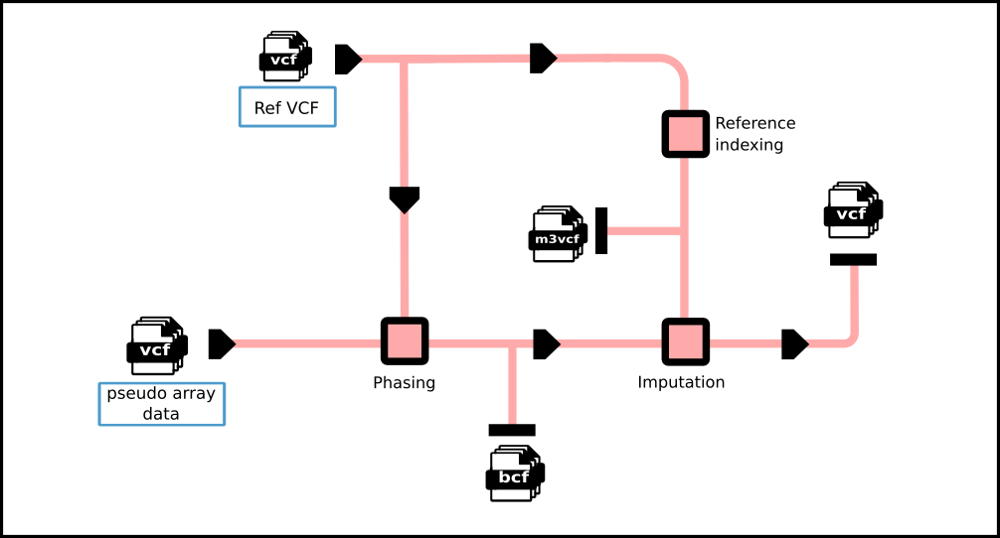

!!! abstract "Requirements"
    - Ubuntu 22.04 (8 CPUs, 32 GB)
    - bcftools (version==1.13)
    - SHAPEIT5 (version==5.1.1)
    - Minimac3 (version==2.0.1)
    - Minimac4 (version==1.0.3)

!!! input "Input data"
    - [Samples list of batch][2]
    - [Phasing reference][1]
    - Imputation panel
    - Pseudo-array VCFs

!!! info "Array imputation workflow"
    
    The reference panel (VCF) was used directly as the phasing reference for pseudo-array genotype data (VCF) and was additionally indexed using **Minimac3** to produce the required m3vcf files for imputation. Phasing was performed prior to imputation using **SHAPEIT5**, with intermediate results stored in BCF format. Imputation was then carried out using **Minimac4**, generating the final imputed VCF outputs.

### Prepare imputation reference

!!! code
    This script extracts a reference panel, phases pseudo SNP array data using [SHAPEIT5][7], and prepares the reference for imputation by indexing it in [Minimac3][8] format.

    ```bash linenums="1"
    --8<--
    imputation/pseudo-array_imputation/_prepare_ref.sh
    --8<--
    ```
    [rename_chr.txt][5] was used to convert to chromosome numeric format. 

### Imputation process 

!!! code
    Genotype imputation is performed using [Minimac4][6]. The phased BCF file is converted and indexed, imputed against a reference panel, and temporary files are removed upon completion.
    ```bash linenums="1"
    --8<--
    imputation/pseudo-array_imputation/impute_minimac4.sh
    --8<--
    ```

!!! output "Output data"
    - SNP-array VCF files


[1]: https://github.com/KTest-VN/lps_paper/tree/main/support_data/maps 
[2]: https://github.com/KTest-VN/lps_paper/tree/main/support_data/sample_list
[4]: https://github.com/KTest-VN/lps_paper/tree/main/imputation/pseudo-array_imputation/bin
[5]: https://github.com/KTest-VN/lps_paper/tree/main/support_data/rename_chr.txt
[6]: https://genome.sph.umich.edu/w/index.php?title=Minimac4_Documentation
[7]: https://odelaneau.github.io/shapeit5/docs/documentation/phase_common/
[8]: https://genome.sph.umich.edu/wiki/Minimac3_Usage