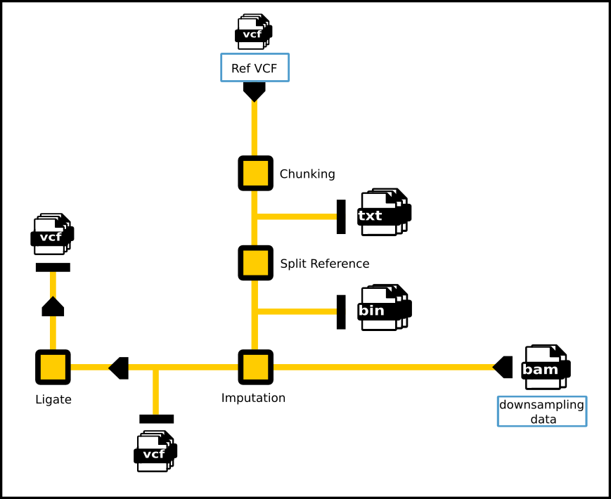

!!! abstract "Requirements"
    - Ubuntu 22.04 (8 CPUs, 32 GB)
    - bcftools (version==1.13)
    - GLIMPSE2 v2.0.0, commit: 8ce534f, release: 2023-06-29

!!! input "Input data"
    - [Samples list of batch][5]
    - [Phasing reference][4]
    - Imputation panel
    - Downsampled BAM

## Low-pass imputation process

??? info "Low-pass imputation workflow"
    
    The imputation reference panel (Ref VCF) was indexed using **GLIMPSE2** and subsequently processed through the *chunking* and *split_reference* steps to generate the appropriate binary input format. The prepared reference panel was then employed to impute genotype data from downsampled BAM files using **GLIMPSE2_phase** modules. Finally, imputed genomic chunks were merged via **GLIMPSE_ligate** to produce the final VCF outputs.

### Prepare imputation reference

!!! code
    Creating imputation reference by using [GLIMPSE2_chunk][6] and [GLIMPSE2_split_reference][7].
    ```bash linenums="1"
    --8<-- "imputation/lowpass_imputation/bin/gen_ref_batch.sh"
    ```
    [build_ref.sh][3] splices raw reference panels (VCF files) to prepare the imputation panel for the GLIMPSE2 imputation process (bin files). 

### Imputation process 

!!! code
    ```bash linenums="1"
    --8<--
    imputation/lowpass_imputation/Bam2Vcf.sh
    --8<--
    ```
    Imputations were processed on autosomes and ligating using [GLIMPSE2_phase][8] and [GLIMPSE2_ligate][9] ([run_imputation_bam_list.sh][1])

!!! output "Output data"
    - lpWGS VCF files


[1]: https://github.com/KTest-VN/lps_paper/blob/main/imputation/lowpass_imputation/bin/run_imputation_bam_list.sh
[2]: https://github.com/KTest-VN/lps_paper/blob/main/imputation/lowpass_imputation/bin/gen_ref_batch.sh
[3]: https://github.com/KTest-VN/lps_paper/blob/main/imputation/lowpass_imputation/bin/build_ref.sh
[4]: https://github.com/KTest-VN/lps_paper/tree/main/support_data/maps 
[5]: https://github.com/KTest-VN/lps_paper/tree/main/support_data/sample_list
[6]: https://odelaneau.github.io/GLIMPSE/docs/documentation/chunk/
[7]: https://odelaneau.github.io/GLIMPSE/docs/documentation/split_reference/
[8]: https://odelaneau.github.io/GLIMPSE/docs/documentation/phase/
[9]: https://odelaneau.github.io/GLIMPSE/docs/documentation/ligate/